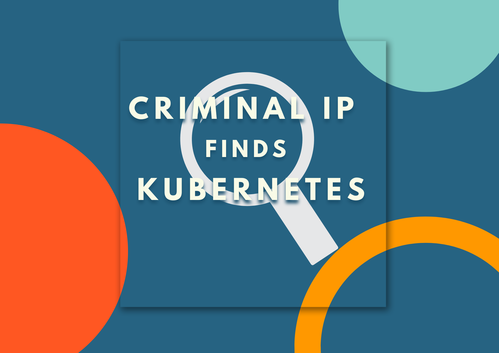

# CriminalIP_Finds_Kubernetes 🧐

 
## 1. About
 
This program uses the Criminal IP banner search API to find Kubernetes-related assets (IP, Port, Title).
 
## 2. Description
 
This program leverages the Criminal IP banner search API to discover Kubernetes-related assets.
 
## 3. Prerequisites
 
To use this program, you need to sign up on [CriminalIP.io](https://criminalip.io) and obtain an API Key.
 
## 4. Installation and Setup / Usage
 
1. Insert the obtained API key into the `x-api-key` variable in the `criminalip_kubernetes.py` file.
2. If you want to add more Criminal IP search queries, include the information in the `query` within the `base_url` of the script.
 
## 5. Add API Key
 
Sign up on [CriminalIP.io](https://criminalip.io) to obtain your API Key.
 
## 6. Getting Started
 
Run the `criminalip_kubernetes.py` file.
 
## 7. Screenshots
 
Running this script will allow you to check the following Kubernetes-related assets:
 

